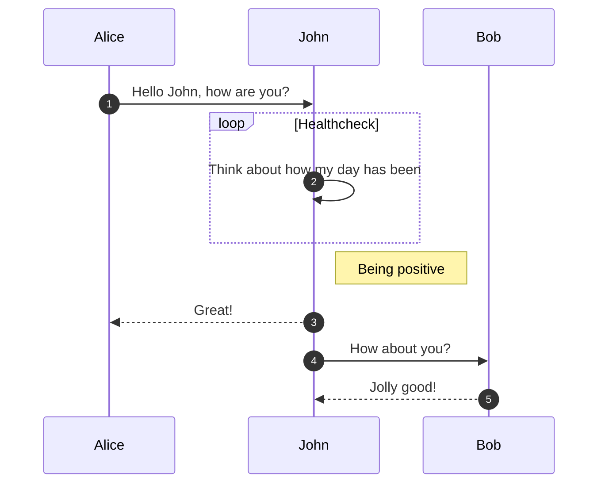

  

    <h1 class="hero__title">Card Management</h1>
    
Documentation for the BNC Card APIs

    

      <button class="button button--secondary button--outline button--lg">
        Get Started
      </button>
    

  

# _

Here you will find guides & API references to help you create & issue BNC branded cards through our domain APIs.

## Download & try out our API